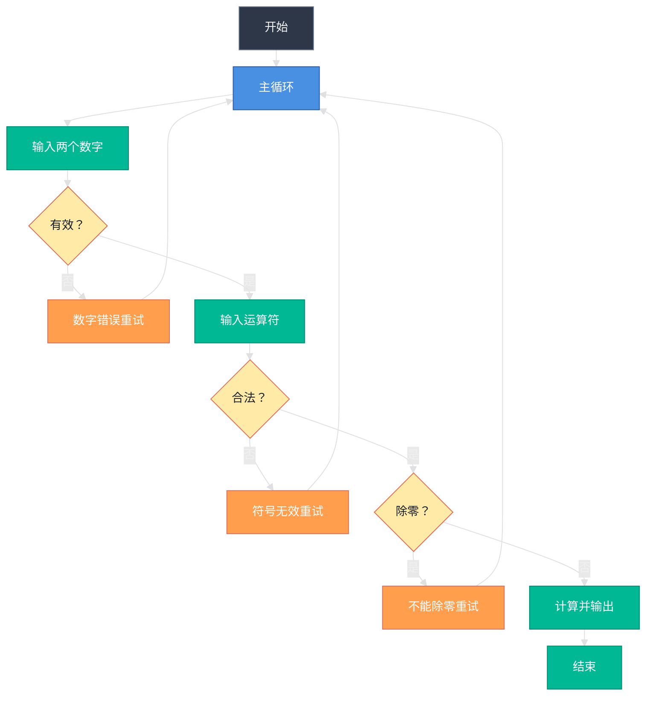

## 简单的计算器

### 流程图示例

### 1. 主程序入口 main 方法
```java
import java.util.Scanner;

public class methoddemo3 {
    public static void main(String[] args) {
        // 主循环：确保用户可以反复操作（当前因 break 只执行一次）
        while (true) {
            // 步骤 1：获取并验证两个数字输入
            String[] inputs;
            boolean valid;
            do {
                inputs = InputNumber1(); // 调用方法获取两个字符串
                // 检查两个输入是否都为有效数字
                valid = Check(inputs[0]) && Check(inputs[1]);
                if (!valid) {
                    System.out.println("输入有误！两个值都必须是数字，请重新输入。\n");
                }
            } while (!valid); // 若无效，循环重输

            // 将验证通过的字符串转为 double 类型
            double num1 = Double.parseDouble(inputs[0]);
            double num2 = Double.parseDouble(inputs[1]);
```
> #### 代码说明：
> * `import java.util.Scanner;`-导入 Scanner 类，用于从控制台读取用户输入
> * `public class methoddemo3`- 定义主类
> * `public static void main(String[] args) `- 程序入口方法
> * `while (true)`- 无限循环，确保程序可以重复运行
> * `do-while`循环用于确保用户输入的两个值都是有效数字
> * `Double.parseDouble()`- 将字符串转换为 double 类型数字

### 2. 运算符处理与除零校验
```java

            // 步骤 2：获取并验证运算符
            boolean validop;
            String operator;
            do {
                Scanner sc = new Scanner(System.in);
                System.out.print("请输入运算符（+、-、*、/）：");
                operator = sc.nextLine().trim(); // 去除首尾空格
                // 判断是否为四种合法运算符之一
                validop = operator.equals("+") ||
                         operator.equals("-") ||
                         operator.equals("*") ||
                         operator.equals("/");
                if (!validop) {
                    System.out.println("无效运算符，请重新输入运算符（+、-、*、/）：");
                }
            } while (!validop);

            // 步骤 3：特殊校验 —— 除数不能为 0
            if (operator.equals("/") && num2 == 0) {
                System.out.println("错误！除数不能为 0，请重新输入。\n");
                continue; // 跳回主循环开头，重新输入全部内容
            }
```
> #### 代码说明：
> * `do-while`循环确保用户输入的运算符是合法的（+、-、*、/）
> * `sc.nextLine().trim()`- 读取整行输入并去除首尾空格
> * `operator.equals() `- 比较字符串内容是否相等
> * `||`逻辑或运算符，检查运算符是否为四种合法运算符之一
> * 除零校验是数学运算中的重要安全检查，避免程序崩溃

### 3. 计算执行与程序结束
```java

            // 步骤 4：执行计算
            double result;
            switch (operator) {
                case "+": result = num1 + num2; break;
                case "-": result = num1 - num2; break;
                case "*": result = num1 * num2; break;
                case "/": result = num1 / num2; break;
                default: result = 0; // 实际不会触发（前面已校验）
            }

            // 输出结果并退出程序（当前逻辑只运行一次）
            System.out.println("运算结果 = " + result);
            break; //  注意：此处 break 会直接退出 while(true)，程序结束
        }
    }
}
```
> #### 代码说明：
> * `switch`语句根据运算符执行不同的计算操作
> * `case "+": result = num1 + num2; break; `- 加法运算
> * `case "-": result = num1 - num2; break;  `- 减法运算
> * `case "*": result = num1 * num2; break; `- 除法运算
> * `case "/": result = num1 / num2; break; `- 除法运算
> * `default: result = 0;`- 默认情况（理论上不会执行，因为前面已校验）
> * `System.out.println()`- 输出计算结果到控制台
> * `break;`- 跳出 while(true) 循环，结束程序执行