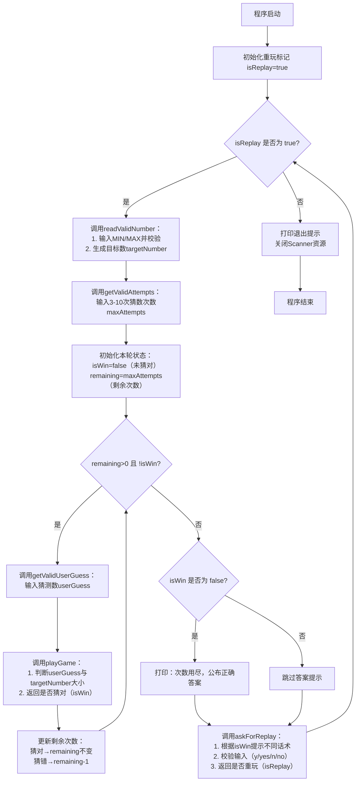

# 一、游戏介绍
本文实现的猜数字游戏具备以下核心功能：
1. 支持玩家自定义猜数的数字范围（最小值 / 最大值）；
2. 支持玩家自定义猜数次数（限制3-10次）；
3. 输入校验：自动过滤非整数输入，确保程序健壮性；
4. 交互友好：实时提示剩余次数、猜大 / 猜小，游戏结束后支持重玩；
5. 代码解释：核心逻辑封装为独立方法。

# 二、游戏整体流程
以下是游戏的核心执行流程，通过流程图直观展示：


# 三、完整代码与逐模块解析
## 1. 全局变量与常量定义

```java
import java.util.Scanner;
import java.util.concurrent.ThreadLocalRandom;

public class guessnumbergame {
    // 存储玩家自定义的猜数范围（最小值/最大值）
    static int USER_MIN_NUMBER;
    static int USER_MAX_NUMBER;
    // 支持重玩/退出的指令常量（统一转小写判断，兼容大小写）
    public static final String[] YES_KEYWORDS={"y","yes"};
    public static final String[] NO_KEYWORDS={"n","no"};
    // 全局Scanner对象（复用，避免重复创建）
    static Scanner scanner =new Scanner(System.in);

    // 核心方法后续讲解...
}
```
### 关键说明
* `USER_MIN_NUMBER/USER_MAX_NUMBER`：静态变量，存储用户输入的数字范围，提供全局方法调用；
* `YES_KEYWORDS/NO_KEYWORDS`：常量数组，存储支持的重玩 / 退出指令（如y/yes/n/no），便于拓展；
* `Scanner对象`：全局Scanner对象（复用，避免重复创建），确保资源高效利用；

## 2. main 方法（核心流程控制器）
main 方法是整个游戏的 “总导演”，串联所有功能方法，控制游戏的整体流程：
```java
public static void main(String[] args) {
    boolean isReplay=true;
    // 游戏主循环：控制是否重玩
    while (isReplay){
        // 1. 输入MIN/MAX，生成目标数
        int targetNumber=readValidNumber();
        // 2. 输入3-10次猜数次数
        int maxAttempts=getValidAttempts();
        // 3. 初始化本轮状态：未猜对、剩余次数=总次数
        boolean isWin=false;
        int remaining=maxAttempts;
        // 本轮猜数循环：有次数且没猜对则继续
        while (remaining>0 && !isWin){
            // 4. 获取玩家输入的猜测数
            int userGuess=getValidUserGuess();
            // 5. 单次猜数判断，返回是否猜对
            isWin=playGame(userGuess,targetNumber,remaining);
            // 6. 更新剩余次数（三元运算符：猜对不变，猜错-1）
            remaining=isWin ? remaining : remaining-1;
        }
        // 7. 本轮结束：没猜对则公布答案
        if(!isWin){
            System.out.println("猜测次数用尽了！正确答案是："+targetNumber);
        }
        // 8. 询问是否重玩，更新重玩标记
        isReplay=askForReplay(isWin);
    }
    // 9. 退出游戏，关闭资源
    System.out.println("按下任意键退出");
    scanner.close();
}

```
### 核心亮点解析
* 双层循环设计：外层 `while (isReplay)` 控制整局重玩，内层 `while (remaining>0 && !isWin)` 控制单局多次猜数；
* 三元运算符 `remaining=isWin ? remaining : remaining-1` ：简化版 `if-else` ，等于：
```java
if (isWin) {
    remaining = remaining; // 猜对则次数不变
} else {
    remaining = remaining - 1; // 猜错则次数-1
}

```
* 资源管理：程序结束前关闭 `Scanner` ，避免内存泄漏。

## 3. 基础输入校验方法：readNumber
封装“读取整数并校验”的基础逻辑，供其他方法复用（如输入 MIN/MAX、次数、猜测数）：
```java
private static int readNumber(String type) {
    int number =0;
    // 循环直到输入合法整数
    while (true){
        System.out.println("请输入"+type+"：");
        String input =scanner.nextLine().trim();
        try{
            // 尝试转换为整数，成功则跳出循环
            number=Integer.parseInt(input);
            break;
        }catch (NumberFormatException e){
            // 转换失败（非整数），提示重新输入
            System.out.println("无效输入,请重新输入整数：");
        }
    }
    return number;
}

```
### 关键说明
* `trim()` ：去除输入字符串的首尾空格，避免“100”这类输入导致的错误；
* `try-catch` ：捕获 `NumberFormatException` （非整数转换异常），保证程序不崩溃。

## 4. 猜数范围校验与目标数生成
### 4.1 readValidNumber：输入并校验 MIN/MAX，生成目标数
```java
private static int readValidNumber(){
    // 调用readNumber输入MIN/MAX
    USER_MIN_NUMBER=readNumber("最小值");
    USER_MAX_NUMBER=readNumber("最大值");

    // 校验：最大值必须大于最小值，否则重新输入最大值
    while (USER_MAX_NUMBER <= USER_MIN_NUMBER){
        System.out.println("最大值必须大于最小值,请重新输入：");
        USER_MAX_NUMBER = readNumber("最大值");
    }
    // 生成目标数并返回
    return generateTargetNumber();
}

````
### 4.2 generateTargetNumber：生成指定范围的随机数
```java
private static int generateTargetNumber () {
    // ThreadLocalRandom：比Random更高效的随机数生成器，支持范围[MIN, MAX]
    int targetNumber = ThreadLocalRandom.current().nextInt(USER_MIN_NUMBER, USER_MAX_NUMBER+1);
    return targetNumber;
}

```
#### 关键说明
* `nextInt(a, b)` ： `[a, b)` 范围的随机数，因此USER_MAX_NUMBER+1才能包含最大值；
* 目标数在单局游戏中 “原子性” 不变：仅在重玩时重新生成。
## 5. 猜数次数校验：getValidAttempts
限制玩家输入 3-10 次猜数次数，非法输入则重新提示：
```java
private static int getValidAttempts (){
    int attempts=0;
    while (true) {
        System.out.println("请输入猜测次数（3-10）：");
        String input = scanner.nextLine().trim();
        try {
            attempts=Integer.parseInt(input);
            // 校验次数范围：3-10
            if (attempts>=3 && attempts <=10){
                break;
            }else {
                System.out.println("次数必须在3-10之间");
            }
        }catch (NumberFormatException e){
            System.out.println("请输入有效的数字：");
        }
    }
    return attempts;
}

```

## 6. 猜数输入校验：getValidUserGuess

复用readNumber的逻辑，专门用于读取玩家的猜测数：
```java
private static int getValidUserGuess(){
    int userGuess =0;
    while (true){
        System.out.println("请输入您猜测的数字：");
        String guess =scanner.nextLine().trim();
        try{
            userGuess=Integer.parseInt(guess);
            break;
        }catch (NumberFormatException e){
            System.out.println("无效输入,请重新输入整数：");
        }
    }
    return userGuess;
}

```
## 7. 单次猜数判断：playGame
核心逻辑：判断玩家单次猜测数与目标数的大小关系，返回是否猜对：
```java
private static boolean playGame(int userGuess, int targetNumber, int attempts){
    int remaining=attempts;
    boolean isWin=false;
    // 判断猜测数与目标数的关系
    if (userGuess>targetNumber){
        remaining--;
        System.out.println("猜大了！剩余次数："+(remaining >= 0 ? remaining:0));
    } else if (userGuess<targetNumber) {
        remaining--;
        System.out.println("猜小了！剩余次数："+(remaining >= 0 ? remaining:0));
    }else {
        // 猜对则标记isWin=true
        isWin=true;
    }
    return isWin;
}

```
### 关键说明：
* 方法仅负责 “单次判断”，不包含循环：循环逻辑由 main 方法的内层 `while` 控制，避免死循环；
* `remaining >= 0 ? remaining:0` ：防止剩余次数为负数（如次数为 0 时仍触发递减），保证提示的准确性。

## 8.重玩询问：askForReplay
根据本轮是否猜对，提示不同话术，支持 y/yes/n/no 指令，非法输入则重新提示：
```java
private static boolean askForReplay(boolean isWin ){
    boolean isValidInput=false;
    boolean isReplay=false;
    // 循环直到输入合法指令
    while (!isValidInput){
        // 根据是否猜对，提示不同话术
        if (isWin){
            System.out.println("猜对了！是否继续游戏（y/n）");
        }else {
            System.out.println("次数用尽！是否继续游戏（y/n）");
        }
        // 输入转小写，兼容Y/YES/N/NO
        String input =scanner.nextLine().trim().toLowerCase();

        // 判断是否为重玩指令
        for (String keyword:YES_KEYWORDS){
            if (input.equals(keyword)) {
                isReplay=true;
                isValidInput=true; // 标记输入合法，跳出循环
                break;
            }
        }
        // 若不是重玩指令，判断是否为退出指令
        if (!isValidInput){
            for (String keyworld:NO_KEYWORDS){
                if (input.equals(keyworld)){
                    isReplay=false;
                    isValidInput=true;
                    break;
                }
            }
        }
        // 非法输入，提示重新输入
        if (!isValidInput){
            System.out.println("输入无效,请重新输入（y/n）！");
        }
    }
    return isReplay;
}

```

### 关键说明：
* 数组遍历判断指令：相比多个 `if-else` 更易扩展（如新增 “是 / 否” 指令，只需往数组中添加元素）； 
* `isValidInput` ：标记输入是否合法，控制循环终止。

# 四、运行示例
以下是一次完整的游戏运行流程：
```plaintext
请输入最小值：
1
请输入最大值：
100
请输入猜测次数（3-10）：
5
请输入您猜测的数字：
50
猜小了！剩余次数：4
请输入您猜测的数字：
75
猜大了！剩余次数：3
请输入您猜测的数字：
66
猜对了！是否继续游戏（y/n）
n
按下任意键退出

```

# 五、核心知识点总结
1. **循环控制**：双层 `while` 循环分别控制“重玩”和“单局猜数”，条件判断精准控制循环终止；
2. **异常处理**：`try-catch`捕获`NumberFormatException`，避免非整数输入导致程序崩溃；
3. **方法封装**：核心逻辑拆分为独立方法（如输入校验、猜数判断、重玩询问），代码解耦且易维护；
4. **三元运算符**：简化 `if-else` 逻辑，提升代码简洁性；
5. **常量与静态变量**：合理使用常量数组存储指令，静态变量共享全局数据。

:spoiler[可能的更新：增加难度分级：如 “简单（10 次）、中等（5 次）、困难（3 次）”，替代手动输入次数；记录玩家历史猜测数：提示 “您已猜测过 XX、XX，请换一个数”；
增加计分功能：猜对次数越少，得分越高。]